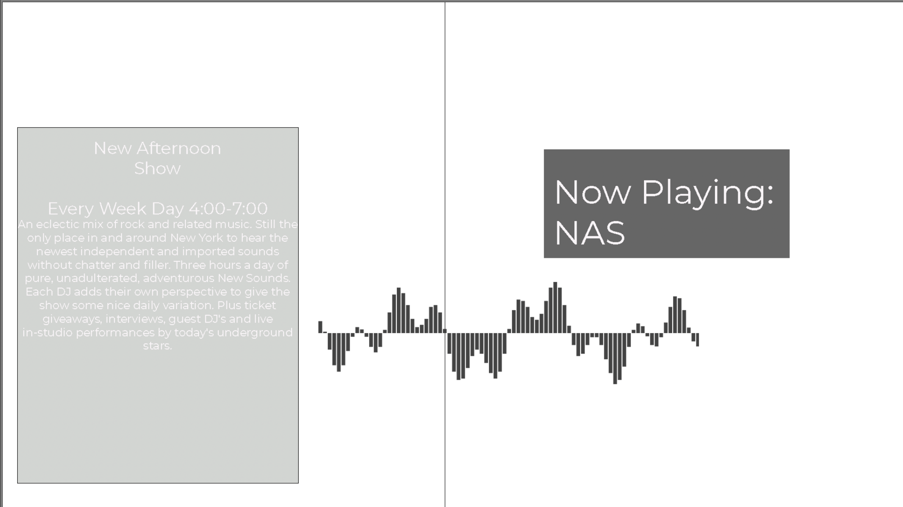

The content below is an example project proposal / requirements document. Replace the text below the lines marked "__TODO__" with details specific to your project. Remove the "TODO" lines.


# WNYU.ORG 

## Overview


WNYU is NYU's student radio station that serves music, news and podcasts all hours of the day on net and 89.1FM!
However te current website is fairly outdated and only getting more deprecated. The goal of this project is not
to fully develop a replacement web server for WNYU but to implement a light-weight model of what the new website 
could look like in the future. 

The intention is to make a web server that can 

1. Display the currently playing program
2. Allow users to search through the list of programs on the station
3. Serve static pages that have information about the radio station, contacts, announcements, etc, etc


## Data Model


The application will store Programs 

* Programs have names, descriptions, hosts, and time slots

An Example Program:

```javascript
{
  programName: "Special K",
  description: "Special K is a show for indie Rock and twee pop primarily from the 90s!",
  host: "Harry Minsky",
  timeSlot: {start:"SATURDAY-08",end:"SATURDAY-10"}        
}
```


## [Link to Commented First Draft Schema](backend/db.mjs) 

## Wireframes


/index the main page of the site that displays the currently playing track



/programs - page for showing all programs currently running on site


/about - page for showing various information about wnyu


/admin/programslist - page for listing current programs on site, only accessible through login


/admin/programslist - page for adding a program


## Site map


## User Stories or Use Cases

1. As a user on the site, I can browse the list of programs available at the station
2. As an admin user on the site, I can add or remove programs 
3. I can listen to the live stream(i believe this is doable by embedding the stream link)

## Research Topics

(__TODO__: the research topics that you're planning on working on along with their point values... and the total points of research topics listed)

* (6 points) Front-end Framework
    * I will be using React for this application
    * For generating and interacting with programs I think that React's component-based approach is the way to go
* (3 points) User Authentication
    * I want to implement user authentication using JWT so that an admin can add programs to the program list

9 points total out of 8 required points


## [Link to Initial Main Project File](backend/server.mjs) 

## Annotations / References Used

(__TODO__: list any tutorials/references/etc. that you've based your code off of)

